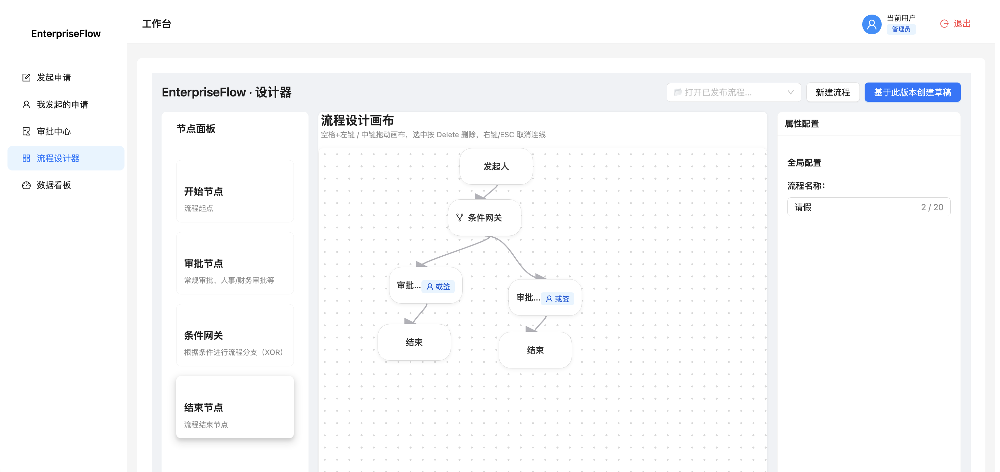
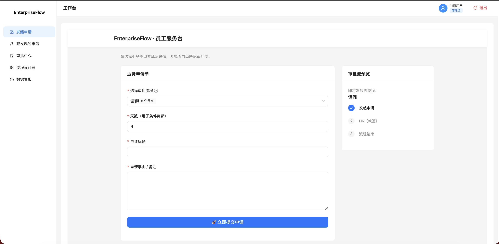
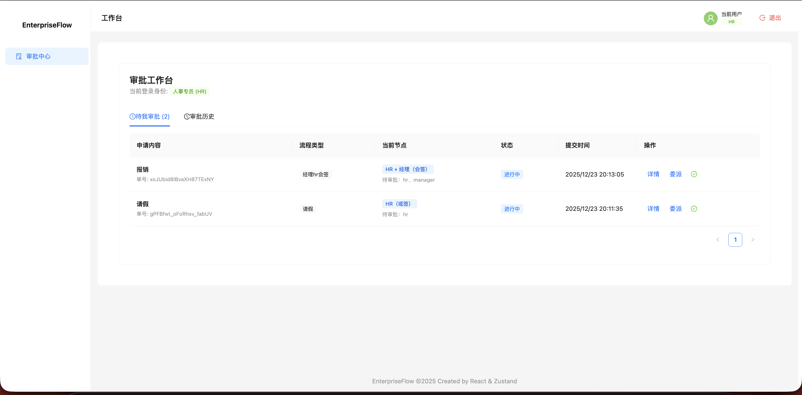
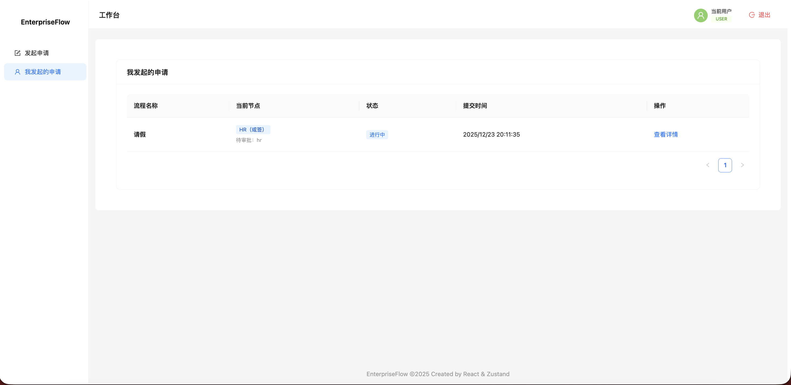
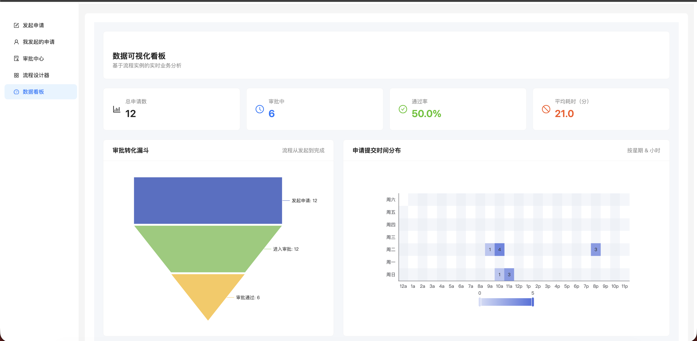

# 🚀 EnterpriseFlow · 流程协作平台（React + Monorepo）


EnterpriseFlow 是一个 **面向企业复杂业务流程的前端流程协作 SaaS 平台**，  
支持通过 **可视化方式定义业务流程**，并完成 **多角色审批流转、流程追踪与数据展示**。

平台覆盖 **流程设计 → 员工申请 → 审批流转 → 数据看板** 的完整闭环，  
可用于 **请假、报销、采购** 等企业流程的线上化与标准化管理。

---

## 🧩 项目整体能力

- 可视化流程设计器（低代码建模）
- 条件网关（金额 / 天数等动态分支）
- 多角色审批（HR / Manager / Finance / Admin）
- 串行审批、会签 / 或签
- 员工申请 & 实时流程预览
- 审批中心 & 审批详情
- 数据可视化看板（Demo）
- Monorepo 工程化拆分

---

## ✨ 核心功能

### 1️⃣ 流程设计器（Designer）

- 基于 **画布 + 节点 + 连线** 的可视化流程建模
- 支持节点类型：
  - 开始节点
  - 审批节点
  - 条件网关（XOR）
  - 结束节点
- 条件分支支持：
  - 金额（amount）
  - 天数（days）
- **流程定义态 / 运行态彻底分离**
- 发布前执行流程合法性校验（断路 / 死路 / 默认路径）

📸 示例：


---

### 2️⃣ 员工发起申请（Apply）

- 选择已发布流程模板
- 根据流程定义 **动态渲染表单字段**
  - 若流程中存在金额 / 天数条件，才显示对应输入框
- 实时预览审批路径（基于运行时条件计算）

📸 示例：


---

### 3️⃣ 审批中心 & 审批详情（Approval）

- 按角色展示「当前可审批任务」
- 支持：
  - 同意 / 拒绝
  - 会签 / 或签
- 审批详情页展示：
  - 表单数据
  - 当前节点
  - 流程步骤与历史日志

📸 示例：


---

### 4️⃣ 我的申请（My Applications）

- 用户查看自己发起的所有流程实例
- 实时展示：
  - 当前节点
  - 流程状态
  - 提交时间

📸 示例：


---

### 5️⃣ 数据可视化看板（Dashboard · Demo）

- 总申请数 / 审批中 / 通过率 / 平均耗时
- 审批转化漏斗
- 提交时间热力图

📸 示例：


---

## 🛠 技术栈

- **前端框架**：React 18 + TypeScript
- **构建工具**：Vite
- **UI 组件库**：Ant Design 5
- **状态管理**：Zustand
- **路由管理**：React Router v6（懒加载）
- **请求管理**：Axios（二次封装）
- **工程管理**：pnpm + Monorepo

---

## 🚀 工程亮点

### 🔐 路由懒加载 & 动态权限控制

- React.lazy + Suspense 实现路由级拆包
- ProtectedRoute 基于角色控制访问权限
- 支持路由模块预加载，提升首屏与切换体验

```tsx
const Approval = React.lazy(() => import("../pages/Approval"));

<Route
  path="/approval"
  element={
    <ProtectedRoute allowedRoles={["hr", "manager", "admin"]}>
      <Approval />
    </ProtectedRoute>
  }
/>
```

---

### ⚙️ Axios 二次封装（工程级）

- 统一接口返回结构（code / message / data）
- 请求 / 响应拦截器
- Token 自动注入
- 错误集中处理
- 预留 **401 Token 刷新队列机制**

**Token 刷新设计：**
- isRefreshing 状态锁
- 并发请求进入队列
- 刷新成功后统一重放

---

## 🧱 Monorepo 架构设计（pnpm）

```
apps/
  saas-platform/        # 主应用（业务层）
packages/
  ui-components/        # 通用 UI 组件
  workflow-sdk/         # 流程引擎 SDK
  utils/                # 工具函数（校验 / 守卫）
```

| 包名 | 职责 |
|---|---|
| ui-components | 页面壳、状态标签等 UI 抽象 |
| workflow-sdk | 流程定义、条件计算、审批路径 |
| utils | 校验、Guard、通用工具 |

```json
"dependencies": {
  "@project/ui-components": "workspace:*",
  "@project/utils": "workspace:*",
  "@project/workflow-sdk": "workspace:*"
}
```

---

## 🧠 架构设计理念

- **设计器 ≠ 业务**
- **流程定义 ≠ 流程实例**
- **UI ≠ 流程引擎**
- 所有条件判断、审批推进均在运行态真实执行

---

## ▶️ 本地运行

```bash
pnpm install
pnpm dev
```

全局构建（Monorepo）：
```bash
pnpm -r build
```

---

## 📌 说明

本项目为 **课程实践 + 工程能力展示项目**，  
重点在于 **工程分层、模型设计与可扩展性**，而非页面数量。

后续可扩展：
- 后端服务接入
- BPMN 兼容
- 流程回滚 / 撤回
- 权限策略引擎

---
