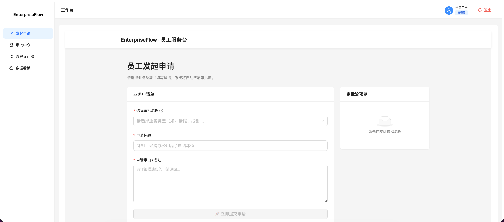
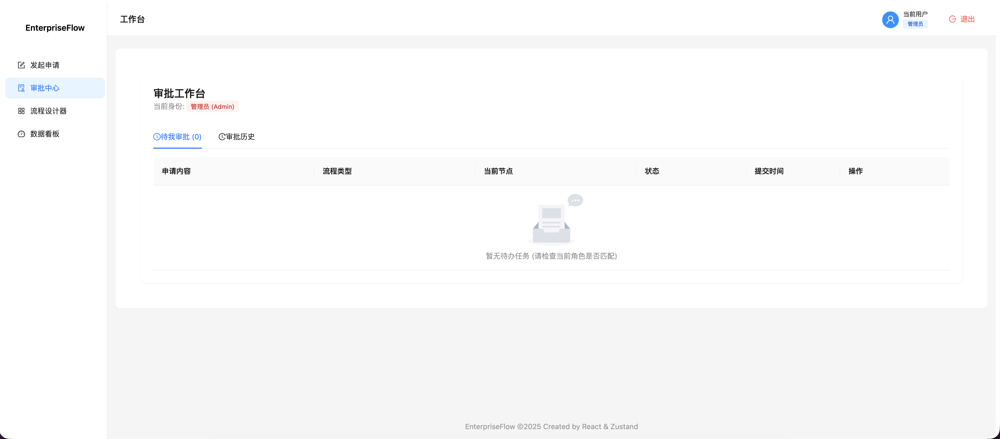
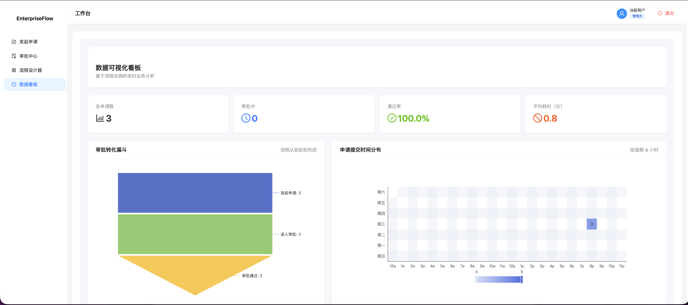

# 🚀 EnterpriseFlow - 企业低代码流程引擎


> 一个基于 **React + TypeScript + Zustand** 构建的轻量级、高性能低代码流程引擎。  
> 实现了从 **可视化流程设计**、**员工表单发起**、**RBAC 审批流转** 到 **数据可视化看板** 的完整业务闭环。

---

## ✨ 项目亮点（Key Features）

### 🎨 1. 可视化流程设计器（Visual Designer）

采用 **“三明治式分层渲染架构”**  
（SVG 连线层 → HTML 节点层 → 交互层），实现复杂交互下的高性能渲染。

**核心能力：**
- 拖拽建模：支持节点自由拖拽、画布平移（Space + Drag）
- 智能连线：贝塞尔曲线连线 + 橡皮筋实时预览
- 交互增强：ESC / 右键取消连线，Delete 删除节点
- 逻辑约束：强制「左进右出（Left-in, Right-out）」
- 图算法校验：流程发布前运行 BFS 校验连通性、死路、断路

> 设计器只负责 **规则定义**，不直接产生业务数据。

---

### 🔐 2. RBAC 权限与审批流转体系

- 内置 Admin / Leader / HR / Finance 角色模型
- 节点级权限控制（approverRole）
- 权限隔离：
  - 管理员：配置流程
  - 员工：发起申请
  - 审批人：仅可处理与自身角色匹配的任务
- 规则在运行态真实控制审批行为

---

### 📄 3. 员工申请 & 审批闭环

- 员工发起页（Apply）
  - 选择流程模板
  - 填写业务表单
  - 实时预览审批链路
- 审批中心（Approval）
  - 展示当前用户可处理的审批实例
  - 支持同意 / 拒绝
- 审批详情页（Detail）
  - 展示表单数据
  - 展示流程节点进度与日志
  - 完整 Apply → Approval → Detail → Approve 闭环

---

### 📊 4. 数据可视化看板（Dashboard）

- KPI：总申请数 / 审批中 / 通过率 / 平均耗时
- 审批转化漏斗
- 申请时间热力图（星期 × 小时）
- 所有数据均来源于真实流程实例

---

## 🛠 技术栈（Tech Stack）

- React 18 + TypeScript
- Vite
- Zustand（persist 本地持久化）
- Ant Design 5
- Apache ECharts
- React Router v6
- nanoid / dayjs

---

## 📂 核心实现细节（Implementation Details）

### 1. 流程图数据结构

```ts
type FlowNode = {
  id: string;
  type: 'start' | 'approval' | 'end';
  name: string;
  position: { x: number; y: number };
  config?: {
    approverRole?: 'leader' | 'hr' | 'finance';
  };
};

type FlowEdge = {
  id: string;
  from: { nodeId: string; anchor: 'right' | 'bottom' };
  to: { nodeId: string; anchor: 'left' | 'top' };
};
```

### 2. 流程发布校验（Graph Validation）

```ts
function validateFlow(nodes, edges) {
  const startNode = nodes.find(n => n.type === 'start');
  const graph = buildAdjacencyList(edges);
  const visited = bfs(graph, startNode.id);

  const endNode = nodes.find(n => n.type === 'end');
  if (!visited.has(endNode.id)) {
    throw new Error('流程断路：无法到达结束节点');
  }
}
```

确保流程 **可执行、可终止、无死路**。

---

## 🚀 本地运行（Getting Started）

```bash
# 1. 克隆项目
git clone https://github.com/your-username/enterprise-flow.git

# 2. 安装依赖
npm install
# 或
yarn install

# 3. 启动开发环境
npm run dev
```

浏览器访问：  
👉 http://localhost:5173

---

## 📸 功能截图（Screenshots）

- **流程设计器（Designer）**  
  

- **员工发起页（Apply）**  
  

- **审批中心（Approval）**  
  

- **数据看板（Dashboard）**  
   

---

## 🗺️ 未来规划（Roadmap）

- 撤回（Undo）/ 重做（Redo）
- 会签 / 或签 / 抄送节点
- 条件分支（Condition Flow）
- 接入后端 API（替换 LocalStorage）
- 支持 BPMN 2.0 导入 / 导出

---

